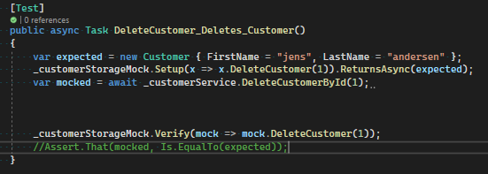
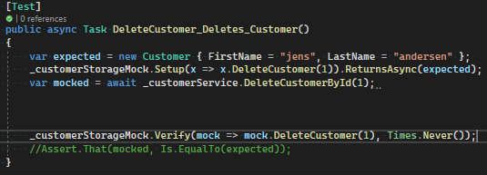
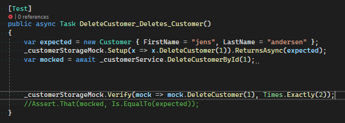
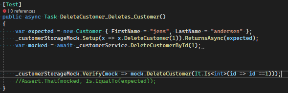
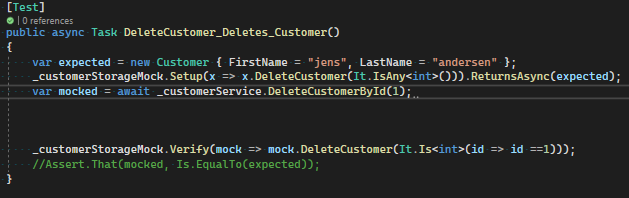

# Test Assignment 4

## Moq
### How do you verify that a mock was called?
We use Moq's _mock.Verify() method to verify that the mock was called

### How do you verify that a mock was not called?
we insert Times.never() to specify verify that the mock was never called

### How do you specify how many times a mock should have been called?
We again use Times.xxx to specify how many times a mock should have been called. In our example we used Exactly(2) to specify that the mock should have been called twice - it fails because it was only called once. 

### How do you specify that a mock was called with specific arguments?
As seen in the photo, we use the Verify() method to specify that the method is to be called with a specific argument

### How do you use a predicate to verify the properties of the arguments given to a call to the mock?
We use the Is.itAny to define what type the argument of the method can use, and not checking the actual value compared to the previous example

